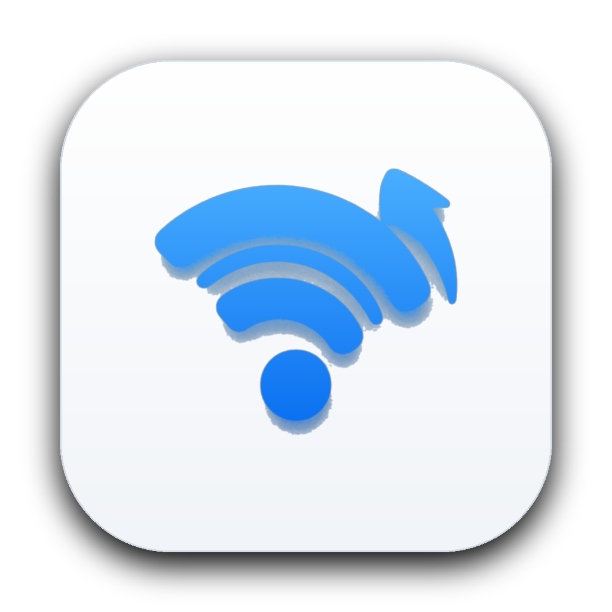

<p align="center">
  
</p>

<h1 align="center">NetTracker</h1>

<p align="center">
  <strong>Native macOS Menu Bar Network Usage Tracker</strong><br>
  <em>SwiftUI frontend elegance meets a high-performance Go measurement engine.</em>
</p>

<p align="center">
  <a href="https://github.com/marwan562/NetTracker/releases/latest"></a>
  <a href="https://github.com/marwan562/NetTracker/actions/workflows/ci.yml"></a>
  
  
</p>

---

## Overview

**NetTracker** is a lightweight, privacy-respecting macOS menu bar application designed to monitor real-time network throughput and track daily data consumption. It pairs a native SwiftUI interface with an efficient Go background daemon connected via a Unix domain socket.

### Key Features

* **Real-time Menu Bar Monitor**: Live upload and download speeds displayed directly in your macOS menu bar.
* **Today's Usage Summary**: Instant breakdown of download, upload, and total traffic for the current day.
* **macOS Battery-Style Usage Matrix**: An interactive daily history chart in Settings modeled after the macOS System Settings > Battery usage graph, with daily bar heights, download/upload split indicators, and detailed usage statistics.
* **Zero Packet Inspection**: Measures byte deltas via system-level interface counters without reading packet contents or browsing habits.
* **Resilient Tracking**: Intelligent re-baselining across network switches (Wi-Fi, Ethernet, VPN), sleep/wake transitions, and counter resets.
* **Local-First & Offline**: State is saved locally to `~/Library/Application Support/NetTracker/history.json` with atomic writes. No data ever leaves your computer.
* **Native Audio & UX**: Subtle native Apple audio feedback on user actions with zero artificial haptics.

---

## Installation

### Option 1: Install via DMG (Recommended)

1. Download the latest **[NetTracker.dmg](https://github.com/marwan562/NetTracker/releases/latest/download/NetTracker.dmg)** from the [Releases](https://github.com/marwan562/NetTracker/releases) page.
2. Double-click `NetTracker.dmg` to open the installer.
3. Drag **NetTracker** into the **Applications** folder shortcut.
4. Launch **NetTracker** from your Applications folder or Spotlight (`⌘ Space`).

> **Note on Gatekeeper (macOS Security)**:
> Since this is an ad-hoc signed open-source build, macOS might ask for confirmation on the first launch. If prompted:
> 1. Right-click (or Control-click) `NetTracker.app` in `/Applications`.
> 2. Click **Open** from the context menu.
> 3. Click **Open** in the dialog to grant approval.

---

### Option 2: Build from Source

#### Prerequisites

* macOS 14.0 (Sonoma) or newer
* Go 1.23+
* Xcode or Xcode Command Line Tools (`xcode-select --install`)
* `create-dmg` (optional, for DMG packaging: `brew install create-dmg`)

#### Build & Run

```sh
# Clone the repository
git clone https://github.com/marwan562/NetTracker.git
cd NetTracker

# Run Go tests and linter
make test
make lint

# Compile Go agent & bundle macOS app
make bundle

# Ad-hoc sign the bundle
make sign

# Build the styled .dmg installer
make dmg

# Launch the app directly
make run
```

---

## Project Structure

```
netracker/
├── assets/                  # Visual assets (AppIcon, logo, DMG background)
│   ├── identity/            # v3 logo source of truth (original, appicon, menubar)
│   ├── logo.png             # Transparent WiFi mark (README, Settings > About)
│   ├── app-icon.png         # 1024x1024 macOS squircle icon (README header)
│   └── dmg-background*.png  # Installer backgrounds
├── macos/                   # Native macOS Swift/SwiftUI app
│   ├── NetTracker/
│   │   ├── App/             # App lifecycle, NSApplicationDelegate, AppState
│   │   ├── MenuBar/         # MenuBarExtra, status items, popover menus
│   │   ├── Settings/        # Settings window & macOS Battery-style Usage Matrix
│   │   ├── Services/        # Go IPC client, LoginItem, Network/Sleep monitors
│   │   ├── Models/          # Swift Codable data models
│   │   └── Resources/       # AppIcon.icns and assets
│   └── NetTracker.xcodeproj # Xcode project configuration
├── agent/                   # Go measurement engine
│   ├── cmd/nettracker-agent # Daemon entry point
│   └── internal/
│       ├── collector/       # gopsutil system network counter reader
│       ├── tracker/         # Sampling, delta computation, gap detection
│       ├── persistence/     # Atomic history persistence
│       └── ipc/             # Unix domain socket JSON server
├── scripts/                 # Automation scripts (build, bundle, sign, dmg, assets)
└── Makefile                 # Make targets for development and release
```

### Regenerating visual assets

The v3 Apple-blue WiFi identity lives in `assets/identity/` (source of truth).
Derived files (`assets/logo.png`, `assets/app-icon.png`, `AppIcon.icns`,
DMG backgrounds) are generated — do not edit by hand:

```sh
make assets
```

See `assets/identity/README.md` for the full identity layout.

---

## Architecture & How It Works

* **Measurement Daemon (`NetTrackerAgent`)**:
  * Samples aggregate network counters every 1 second.
  * Attributes deltas by real elapsed wall time.
  * Re-baselines smoothly on counter wraps, gaps > 5 seconds, sleep/wake events, or network interface changes.
  * Persists daily history snapshots atomically to disk once per minute and on graceful exit.
* **Inter-Process Communication (IPC)**:
  * Communication occurs over a local Unix domain socket (`~/Library/Caches/NetTracker/agent.sock`) using newline-delimited JSON.
  * SwiftUI polls snapshots every second and refreshes historical records on demand.
* **Privacy & Efficiency**:
  * Minimal CPU footprint (< 0.5% CPU).
  * No packet inspection or elevated permissions required.
  * Cloud sync is disabled by default and 100% opt-in.

---

## License

This project is licensed under the MIT License — see the [LICENSE](LICENSE) file for details.
